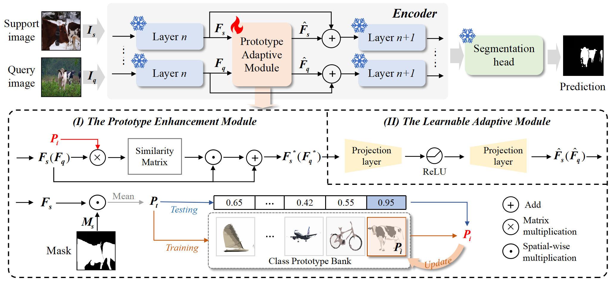
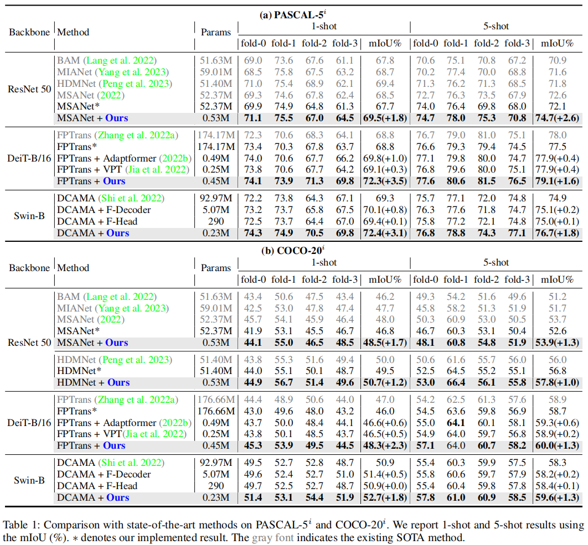

<h2 align="center"> <a href="https://github.com/jingw193/Adaptive_FSS">Adaptive_FSS: A Novel Few-Shot Segmentation Framework via Prototype Enhancement</a></h2>
<h5 align="center"> If you like our project, please give us a star ⭐ on GitHub for latest update.  </h2>

<h5 align="center">
</h5>

## [Project page](https://jingw193.github.io/Adaptive_FSS/) | [Paper (Coming Soon)]() | [Video (Coming Soon)]()

## 😮 Highlights
this paper proposes a novel FSS framework based on the adapter mechanism that can greatly improve the performance of the current FSS model by adapting it to novel classes.

## 🚩 **Updates**
Welcome to **watch** 👀 this repository for the latest updates.
- [ ] Paper released.
- [ ] Code release.
- [ ] Video release.

## 🚀 Experimental Results

### Quantitative comparison

### Qualitative comparison

## 👍 **Acknowledgement**
This work is built on many amazing research works and open-source projects, thanks a lot to all the authors for sharing!
* [DCAMA(ECCV2022)](https://github.com/pawn-sxy/DCAMA)
* [FPTrans(NeurIPS2022)](https://github.com/Jarvis73/FPTrans)
* [HDMNet(CVPR2023)](https://github.com/Pbihao/HDMNet)
* [MSANet(2023)](https://github.com/AIVResearch/MSANet)

## ✏️ Citation
If you find our paper and code useful in your research, please consider giving a star :star: and citation :pencil:.
